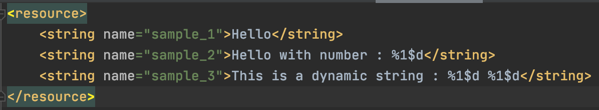
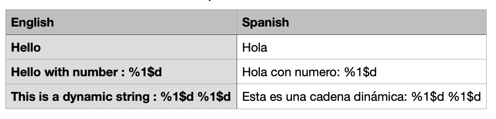
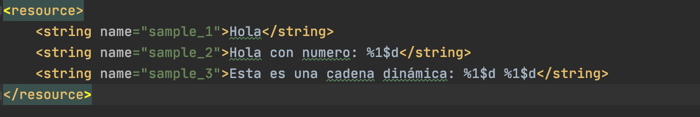

# CsvToXmlMapper
While translating your app, your translator provides you with a `.csv` file containing the translated strings and you 
wonder how boring and tedious it will be to copy those strings one by one? Look no more! CsvToXmlMapper is here to your rescue!

## Sample input

Sample `strings.xml` input file:

<p align="center">
  
</p> 

Sample `csv_file_from_translator.csv` input file:

<p align="center">
  
</p> 

## Sample output

Sample `strings.xml` output file:

<p align="center">
  
</p> 


## How to use
- Clone the repository
- Paste your original `strings.xml` file at the root level inside the project  to overwrite the existing file.
- Paste your original csv file which contains the translated strings at the root level inside the project
- Open the `main.kt` file in the project
- Change the file name we are passing to the `FileReader` to match your file name as👇
  ```
   val csvReaderBuilder = CSVReaderBuilder(
        FileReader("<your file name here>.csv")
    )
  ```
- Run the project!

You should now have an output file which would be named `strings_translated.xml` containing your formatted translatted string! 🚀


## About the Author

### Abhriya Roy

 Android Developer with 3 years of experience in building apps that look and feel great. 
 Enthusiastic towards writing clean and maintainable code.
 Open source contributor.

 <a href="https://www.linkedin.com/in/abhriya-roy/"></a>     &nbsp;
 <a href="https://twitter.com/AbhriyaR"></a> 
 &nbsp;
 <a href="https://stackoverflow.com/users/6197251/abhriya-roy"></a> 
 &nbsp;
 <a href="https://angel.co/abhriya-roy?public_profile=1"></a>
 &nbsp;
 <a href="https://play.google.com/store/apps/developer?id=Zebro+Studio"></a>

 <br>
  
